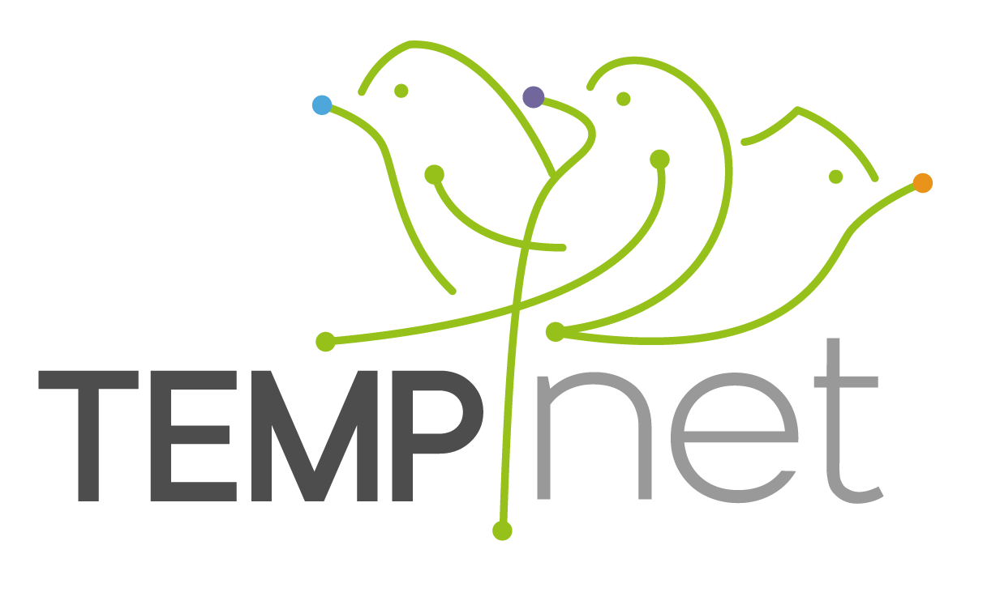

```{r logo_import, echo = F, fig.width = 3, fig.height= 3}
library(knitr)



```

TEMPNET Action aims at providing a deep understanding on how phenological changes in interacting plant and animals affect their dynamics over seasonal and long-term timespans. Given the current ecological crisis in which we are immersed, unveiling the complexity of ecological interactions is fundamental for biodiversity conservation. For this, we have combined state-of-the-art mathematical advances in multilayer network analysis, sound ecological theory, and field observations.

*TEMPNET* project has received funding from the European Union’s Horizon 2020 research and innovation
programme under the Marie Sklodowska-Curie grant agreement No 798269. 


```{r EUlogo_import, echo = F, fig.width = 4, fig.height= 4}

include_graphics("photos/normal-reproduction-high-resolution.jpg")
```

### **RESULTS**
We have recently published the first publication derived from TEMPNET in *Oikos* journal. You can read it in this [link](https://doi.org/10.1111/oik.08387)